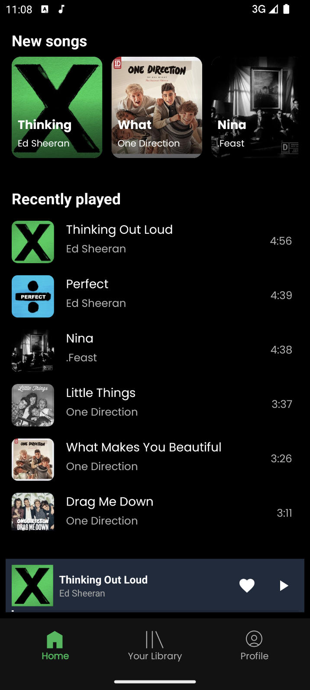
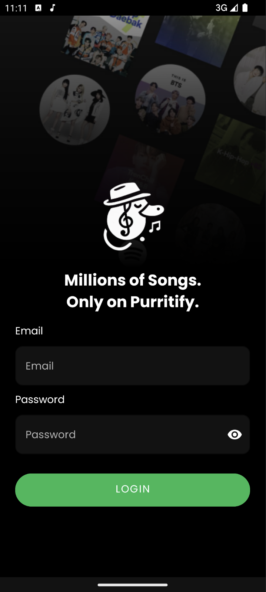
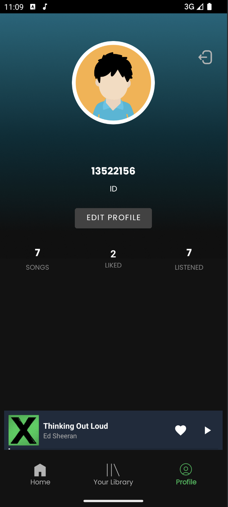
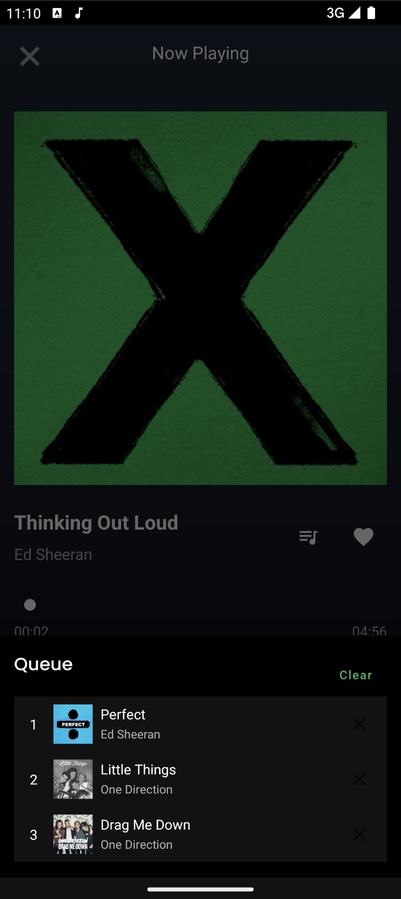

<h1 align="center">Tugas Besar 1 - Android - IF3210 Mobile Development</h1>
<h2 align="center">Aplikasi Purrytify 🎶 </h2>

<div align="center">
  
</div>

## ️🖥️ Deskripsi Aplikasi Purrytify
Purrytify adalah sebuah aplikasi streaming musik yang dirancang untuk memberikan pengalaman mendengarkan musik yang personal dan nyaman. Aplikasi ini menawarkan berbagai fitur modern yang dirancang untuk memenuhi kebutuhan pengguna, mulai dari eksplorasi koleksi musik hingga pengelolaan daftar lagu favorit secara efisien.

Melalui antarmuka yang intuitif, pengguna dapat dengan mudah menjelajahi halaman Home untuk melihat lagu yang baru saja diputar atau lagu terbaru yang tersedia. Halaman Library memungkinkan pengguna mengakses koleksi lengkap lagu serta daftar lagu yang disukai. Semua lagu dapat diputar langsung hanya dengan sekali tekan.

Purrytify juga menyediakan fitur pemutaran musik yang lengkap, termasuk play/pause, next, previous, dan navigasi durasi melalui progress bar. Mini player selalu terlihat untuk mempermudah akses kontrol pemutaran tanpa mengganggu navigasi aplikasi. Pengguna juga dapat menambahkan lagu baru dari penyimpanan perangkat mereka, lengkap dengan metadata seperti judul, artis, dan cover album.

Aplikasi ini dilengkapi dengan sinkronisasi data yang mulus, autentikasi pengguna yang aman, serta kemampuan mendeteksi kondisi jaringan internet. Bahkan saat koneksi terputus, pengguna tetap dapat menikmati musik yang telah tersedia di perangkat mereka. Fitur pencarian yang cepat dan akurat membantu pengguna menemukan lagu berdasarkan judul atau nama artis dengan mudah. Fitur seperti Queue dan Shuffle mempermudah pengguna dalam mengelola dan menikmati musik sesuai preferensi mereka.

Dengan desain modern, fitur lengkap, dan fokus pada pengalaman pengguna, Purrytify menjadi solusi ideal untuk menikmati musik kapan saja dan di mana saja.


## ️📚 *Library* yang digunakan

### AndroidX Core Libraries

1. **androidx.core:core-ktx** - Fitur Kotlin Extensions untuk Android.

2. **androidx.appcompat:appcompat** - Kompatibilitas backwards dengan fitur-fitur modern Android.

3. **com.google.android.material:material** - Komponen Material Design untuk UI.

### Navigation Component

4. **androidx.navigation:navigation-fragment-ktx** - Navigasi fragment dengan integrasi Kotlin.

5. **androidx.navigation:navigation-ui-ktx** - Navigasi UI dengan dukungan Kotlin.

### Networking dan API

6. **com.squareup.retrofit2:retrofit** - Library untuk HTTP Client berbasis REST.

7. **com.squareup.retrofit2:converter-gson** - Converter untuk JSON parsing menggunakan Gson.

8. **com.squareup.okhttp3:logging-interceptor** - Logging HTTP request dan response.

### Image Loading 

9. **io.coil-kt:coil** - Library modern untuk memuat gambar berbasis Kotlin.

10. **com.github.bumptech.glide:glide** - Library populer untuk pemrosesan gambar.

11. **androidx.lifecycle:lifecycle-service** - Lifecycle-aware components untuk Service.

### Color Extraction

12. **androidx.palette:palette-ktx** - Ekstraksi warna dari gambar.

### Media Playback

13. **androidx.media3:media3-exoplayer** - Framework pemutaran media berbasis ExoPlayer.

14. **androidx.media3:media3-ui** - UI media player dari ExoPlayer.

15. **androidx.media3:media3-session** - Session untuk mengelola playback state.

### Lifecycle Components

16. **androidx.lifecycle:lifecycle-viewmodel-ktx** - ViewModel untuk mengelola data UI.

17. **androidx.lifecycle:lifecycle-livedata-ktx** - LiveData untuk reactivity.

18. **androidx.lifecycle:lifecycle-runtime-ktx** - Runtime untuk komponen lifecycle-aware.

### Coroutines

19. **org.jetbrains.kotlinx:kotlinx-coroutines-android** - Coroutines untuk Android.

20. **org.jetbrains.kotlinx:kotlinx-coroutines-core** - Coroutines untuk Kotlin.

### Room Database

21. **androidx.room:room-runtime** - Runtime untuk Room Database.

22. **androidx.room:room-ktx** - API Kotlin Extensions untuk Room.

23. **androidx.room:room-compiler** - KAPT untuk kompilasi kode Room.

### Work Manager

24. **androidx.work:work-runtime-ktx** - WorkManager untuk *background services*.

### Fragment

25. **androidx.fragment:fragment-ktx** - Fragment dengan integrasi Kotlin Extensions.

### Media Player

26. **androidx.media:media** - Komponen media player berbasis framework Android.

### Security

27. **androidx.security:security-crypto** - Library keamanan untuk enkripsi data.


## 📸  *Screenshot* Aplikasi

<div style="display: flex; flex-wrap: wrap; justify-content: space-around; gap: 20px;">
    <div>
        
        <p style="text-align: center;">Add Song</p>
    </div>
    <div>
        
        <p style="text-align: center;">Edit Song</p>
    </div>
    <div>
        
        <p style="text-align: center;">Home</p>
    </div>
    <div>
        
        <p style="text-align: center;">Library - All Song</p>
    </div>
    <div>
        
        <p style="text-align: center;">Library - Liked</p>
    </div>
    <div>
        
        <p style="text-align: center;">Login</p>
    </div>
    <div>
        
        <p style="text-align: center;">Profile</p>
    </div>
    <div>
        
        <p style="text-align: center;">Queue</p>
    </div>
    <div>
        
        <p style="text-align: center;">Track View</p>
    </div>
</div>


## 🧑‍💻 Pembagian Kerja Anggota Kelompok

1. Aland Mulia Pratama - 13522124

    - Implementasi halaman profil dan validasi data pengguna.

    - Penyempurnaan halaman Home dan Library (integrasi liked songs, recently played).

    - Implementasi fitur penghapusan, pengeditan lagu, dan validasi berdasarkan userID.

    - Pengerjaan fitur Network Sensing untuk profil dan login.

    - Pengelolaan font dan elemen visual di berbagai halaman.

    - Menambahkan fitur OWASP (M4) untuk keamanan aplikasi.

    - Menulis README.md.

    - Memperbaiki bug pada Edit Song

2. Christian Justin Hendrawan - 13522135

    - Inisialisasi proyek dan pengaturan awal (commit awal, setup project).

    - Implementasi fitur login, logout, dan dekorasi halaman login.

    - Pengerjaan fungsi-fungsi library, integrasi database ke Home, dan refactor token.

    - Pembuatan mekanisme penambahan lagu.

    - Pemutakhiran halaman Library dan Home.

    - Pengerjaan background service untuk token refresher.

    - Perbaikan integrasi profil dan edge case navigasi.

    - Pengembangan fitur like/unlike, queue, serta pengaturan mini player.

    - Penambahan komentar pada berbagai komponen.

3. Jason Fernando - 13522156

    - Pengembangan halaman Home, splash screen, dan media player.

    - Integrasi mini player dengan halaman Now Playing.

    - Implementasi fitur pencarian di Library.

    - Pengerjaan fitur ekstraksi warna dari gambar album.

    - Refactor tampilan trek dan fitur pemutar lagu.

    - Penambahan komentar pada kode.

## ⌚️ Jumlah jam persiapan dan pengerjaan untuk masing-masing anggota

<table border="1" cellspacing="0" cellpadding="8">
  <thead>
    <tr>
      <th>Nama Anggota</th>
      <th>Item yang Dikerjakan</th>
      <th>Jam</th>
    </tr>
  </thead>
  <tbody>
    <tr>
      <td rowspan="8">Christian Justin Hendrawan</td>
      <td>Inisialisasi proyek dan setup awal</td>
      <td>5</td>
    </tr>
    <tr>
      <td>Implementasi fitur login/logout dan dekorasi halaman login</td>
      <td>6</td>
    </tr>
    <tr>
      <td>Pengerjaan fungsi Library dan integrasi database ke Home</td>
      <td>6</td>
    </tr>
    <tr>
      <td>Pembuatan mekanisme penambahan lagu</td>
      <td>6</td>
    </tr>
    <tr>
      <td>Pengembangan background service (token refresher)</td>
      <td>5</td>
    </tr>
    <tr>
      <td>Penyempurnaan navigasi dan perbaikan edge case</td>
      <td>5</td>
    </tr>
    <tr>
      <td>Pengerjaan fitur queue dan mini player</td>
      <td>6</td>
    </tr>
    <tr>
      <td>Penambahan komentar dan dokumentasi kode</td>
      <td>4</td>
    </tr>
    <tr>
      <td colspan="2"><strong>Total</strong></td>
      <td><strong>43</strong></td>
    </tr>
    <tr>
      <td rowspan="8">Aland Mulia Pratama</td>
      <td>Implementasi halaman profil</td>
      <td>5</td>
    </tr>
    <tr>
      <td>Penyempurnaan Home dan Library (liked songs, recently played)</td>
      <td>6</td>
    </tr>
    <tr>
      <td>Implementasi fitur penghapusan/edit lagu</td>
      <td>6</td>
    </tr>
    <tr>
      <td>Pengembangan fitur Network Sensing</td>
      <td>5</td>
    </tr>
    <tr>
      <td>Penambahan fitur keamanan OWASP (M4 & M8)</td>
      <td>5</td>
    </tr>
    <tr>
      <td>Penyesuaian elemen visual di halaman</td>
      <td>5</td>
    </tr>
    <tr>
      <td>Menulis README.md</td>
      <td>2</td>
    </tr>
    <tr>
      <td>Memperbaiki bug pada edit song</td>
      <td>3</td>
    </tr>
    <tr>
      <td colspan="2"><strong>Total</strong></td>
      <td><strong>41</strong></td>
    </tr>
    <tr>
      <td rowspan="6">Jason Fernando</td>
      <td>Pengembangan halaman Home dan splash screen</td>
      <td>5</td>
    </tr>
    <tr>
      <td>Implementasi media player dan mini player</td>
      <td>6</td>
    </tr>
    <tr>
      <td>Integrasi fitur pencarian di Library</td>
      <td>6</td>
    </tr>
    <tr>
      <td>Fitur ekstraksi warna dari gambar album</td>
      <td>5</td>
    </tr>
    <tr>
      <td>Refaktor tampilan trek dan player</td>
      <td>5</td>
    </tr>
    <tr>
      <td>Penambahan komentar pada kode</td>
      <td>5</td>
    </tr>
    <tr>
      <td colspan="2"><strong>Total</strong></td>
      <td><strong>42</strong></td>
    </tr>
  </tbody>
</table>


## 🔐 Analisis dan Perbaikan OWASP

### M4: Insufficient Input/Output Validation
1. Validasi Email pada Login

    **Masalah Sebelum Perubahan:** Kode awal memeriksa apakah email dan password kosong, tetapi tidak melakukan validasi lebih lanjut pada format email. Input email yang tidak valid dapat menyebabkan aplikasi mengirimkan permintaan yang tidak berarti ke server, meningkatkan beban server, atau bahkan memicu potensi celah keamanan lainnya.

    **Pentingnya Perubahan:** Validasi input seperti memastikan format email yang benar dapat mencegah serangan sederhana seperti SQL Injection, Command Injection, atau data yang tidak valid yang dapat digunakan untuk eksploitasi.

    Sebelum:
    ```kt
        fun login(email: String, password: String) {
        if (email.isBlank() || password.isBlank()) {
            _loginState.value = LoginState.Error("Email and password cannot be empty")
            return
        }

        viewModelScope.launch {
            _loginState.value = LoginState.Loading
            val result = userRepository.login(email, password)
            _loginState.value = when {
                result.isSuccess -> LoginState.Success
                else -> LoginState.Error(result.exceptionOrNull()?.message ?: "Login failed")
            }
        }
    }
    ```

    Sesudah:
    ```kt
    fun login(email: String, password: String) {
        if (email.isBlank() || password.isBlank()) {
            _loginState.value = LoginState.Error("Email and password cannot be empty")
            return
        }

        viewModelScope.launch {
            _loginState.value = LoginState.Loading
            val result = userRepository.login(email, password)
            _loginState.value = when {
                result.isSuccess -> LoginState.Success
                else -> {
                    val rawMessage = result.exceptionOrNull()?.message
                    val sanitizedMessage = mapServerErrorToMessage(rawMessage)
                    LoginState.Error(sanitizedMessage)
                }
            }
        }
    }

    private fun mapServerErrorToMessage(rawMessage: String?): String {
        return when {
            rawMessage?.contains("401", ignoreCase = true) == true -> {
                "Email or password is incorrect. Please try again."
            }
            rawMessage?.contains("500", ignoreCase = true) == true -> {
                "Server is currently unavailable. Please try again later."
            }
            else -> "An unexpected error occurred. Please check your connection or try again."
        }
    }
    ```

2. Sanitasi Output (Output Validation)

    **Masalah Sebelum Perubahan:** Pesan kesalahan dari server diteruskan langsung ke pengguna tanpa diproses. Ini berisiko membuka informasi internal aplikasi (seperti kode status, pesan error server, atau detail debugging) yang bisa dieksploitasi oleh penyerang untuk mengetahui kelemahan sistem.
    
    **Pentingnya Perubahan:** Dengan menambahkan fungsi mapServerErrorToMessage, aplikasi menyembunyikan detail internal sistem dari pengguna. Langkah ini mencegah Information Disclosure, salah satu risiko utama yang diidentifikasi oleh OWASP.
    
    Misalnya:
    - Kode status **401** diubah menjadi pesan yang lebih ramah pengguna tanpa mengungkapkan detail autentikasi yang gagal.


### M8: Security Misconfiguration

1. Network Security Configuration

    Masalah Sebelum Perubahan: Tidak memvalidasi server yang digunakan rentan terhadap serangan Man-in-the-Middle (MitM). Menerima semua domain, termasuk yang tidak valid.

    Pentingnya Perubahan: Menggunakan Network Security Configuration melindungi serangan Man-in-the-Middle (MitM). Membatasi akses hanya ke domain `34.101.226.132` dan menolak protokol tidak aman.

    Contoh Implementasi:
    ```xml
    <?xml version="1.0" encoding="utf-8"?>
    <network-security-config>
        <domain-config cleartextTrafficPermitted="true">
            <domain includeSubdomains="true">34.101.226.132</domain>
        </domain-config>
    </network-security-config>
    ```
2. Membatasi Izin (Permissions)

    Sejak awal pengembangan, aplikasi telah dirancang dengan menerapkan prinsip Least Privilege, memastikan hanya izin yang relevan dimasukkan dalam AndroidManifest.xml, seperti izin akses internet yang diperlukan untuk fungsi aplikasi.

    Contoh Implementasi:
    ```xml
      <!-- Required permissions -->
    <uses-permission android:name="android.permission.INTERNET" />
    <uses-permission android:name="android.permission.ACCESS_NETWORK_STATE" />
    <uses-permission android:name="android.permission.FOREGROUND_SERVICE" />
    <uses-permission android:name="android.permission.FOREGROUND_SERVICE_MEDIA_PLAYBACK" />
    <uses-permission android:name="android.permission.READ_EXTERNAL_STORAGE" android:maxSdkVersion="32" />
    <uses-permission android:name="android.permission.READ_MEDIA_AUDIO" android:minSdkVersion="33" />
    <uses-permission android:name="android.permission.READ_MEDIA_IMAGES" android:minSdkVersion="33" />
    ```

### M9: Insecure Data Storage

SharedPreferences pada Android adalah penyimpanan bawaan yang aman untuk menyimpan data ringan seperti pengaturan pengguna atau token. Dalam konteks **OWASP M9: Insecure Data Storage**, SharedPreferences direkomendasikan karena data disimpan secara terintegrasi dalam sistem Android, dengan mekanisme bawaan seperti file permissions yang hanya dapat diakses oleh aplikasi itu sendiri (sandboxing).

Menggunakan **encryption.utils** memang menambahkan lapisan keamanan melalui enkripsi, tetapi data yang dienkripsi tidak persisten dan dapat hilang setelah aplikasi direstart. Oleh karena itu, SharedPreferences tetap menjadi pilihan terbaik untuk menyimpan data yang perlu bertahan lama dengan keamanan memadai, asalkan praktik terbaik diterapkan, seperti menggunakan **EncryptedSharedPreferences** untuk enkripsi otomatis dan meminimalkan risiko akses tidak sah. Hal ini memastikan keseimbangan antara keamanan dan kebutuhan aplikasi untuk penyimpanan data jangka panjang.